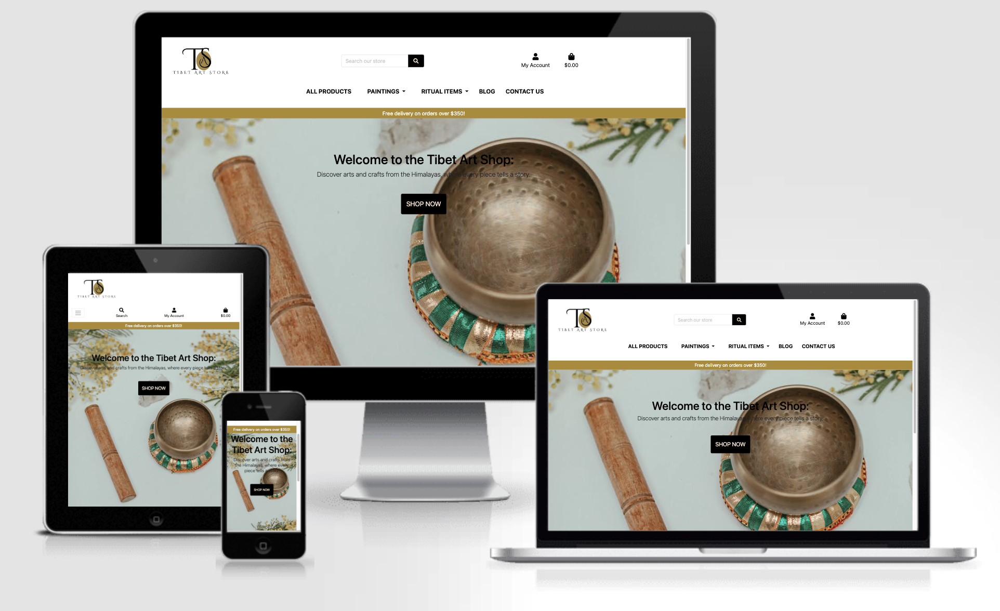
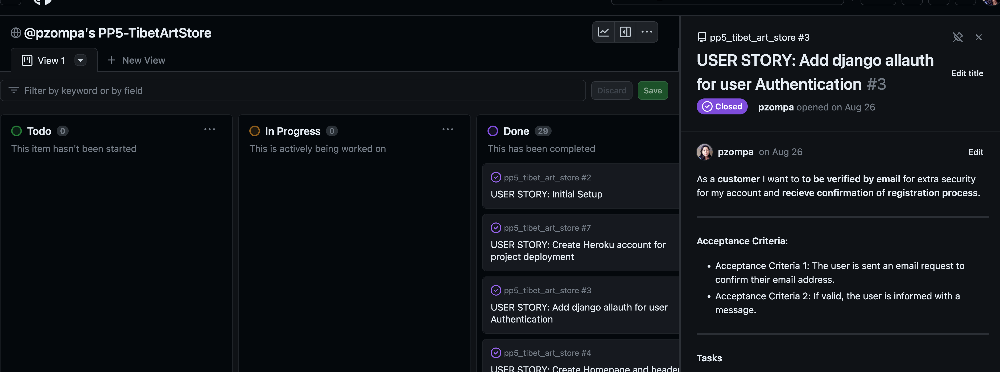
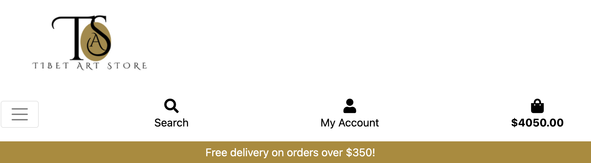
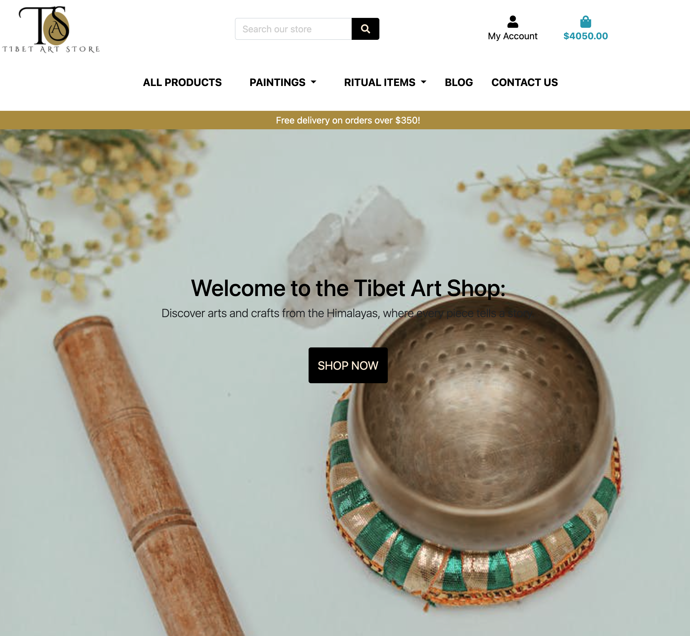
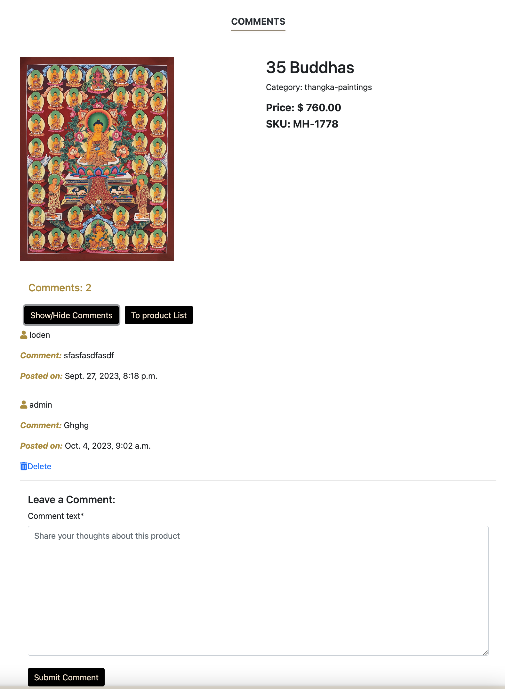
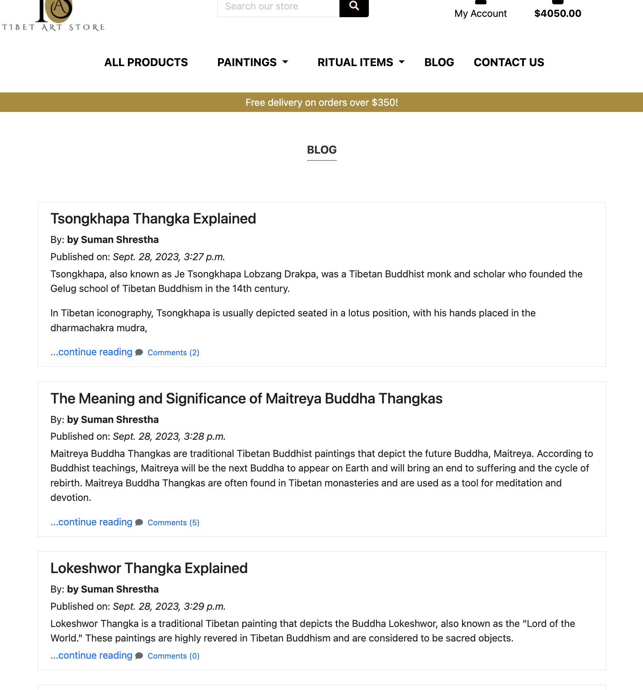
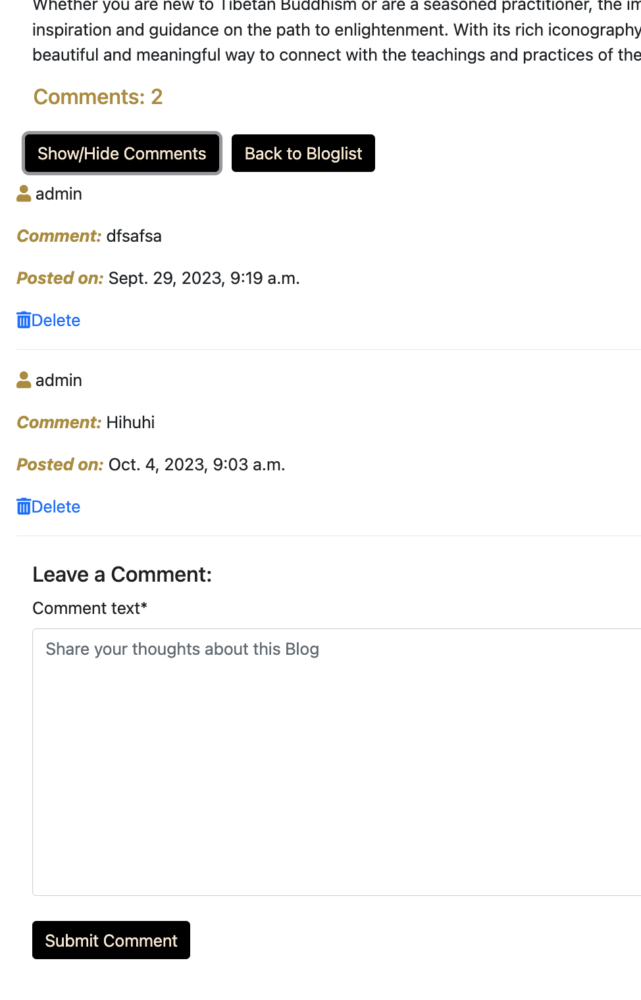
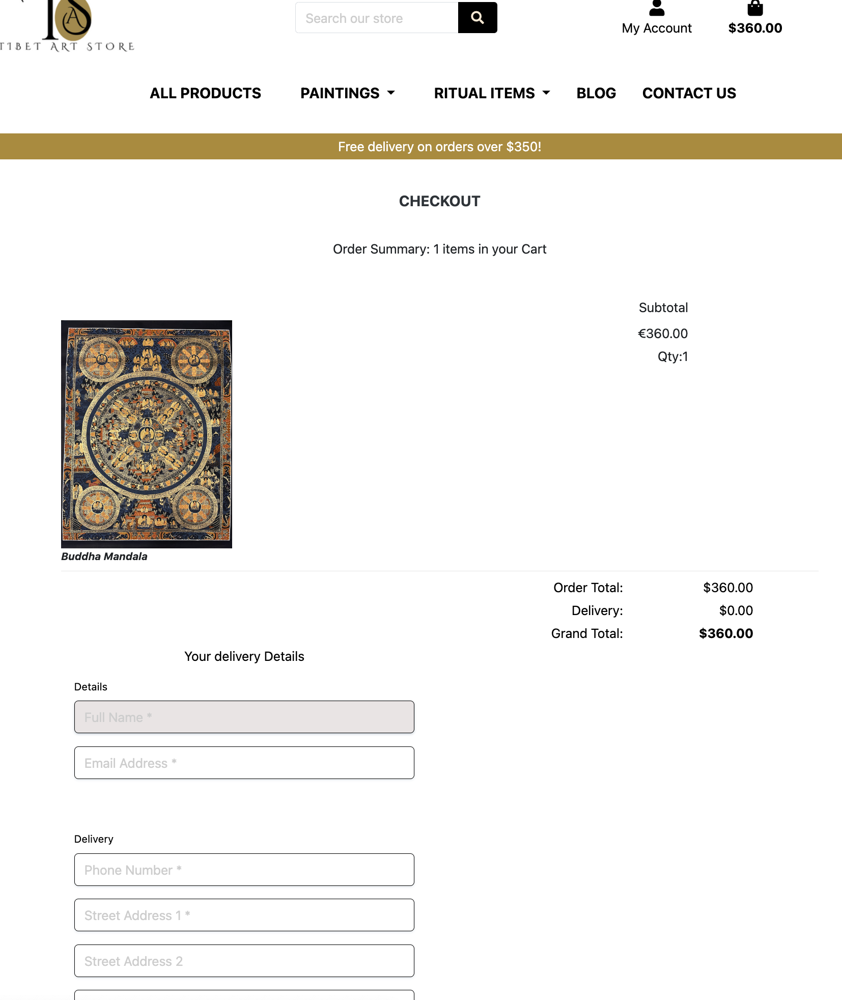
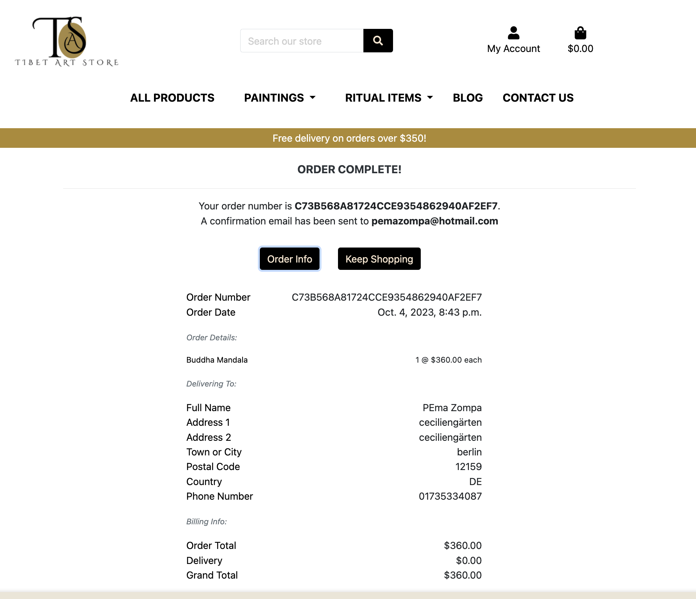
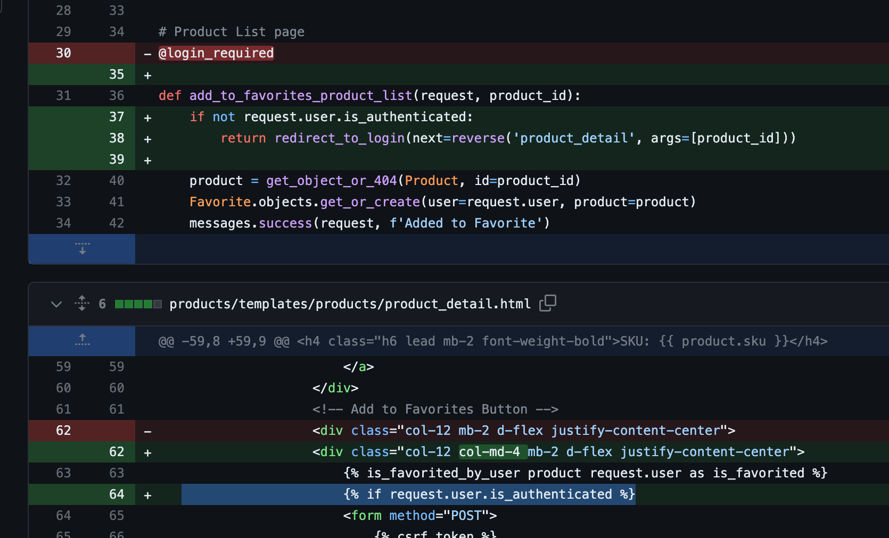

# Tibet Art Store


<table of content>

1. [Overview](#overview)
2. [Business Model](#business-model)
   1. [Target Audience](#target-audience)
   2. [Value Proposition](#value-proposition)
   3. [Customer Relationships](#customer-relationships)
   4. [SEO](#seo)
   5. [Marketing](#marketing)
      1. [Facebook business page](#facebook-business-page)
3. [User Experience(UX)]()
   1. [User Requirements and Expectations](#user-requirements-and-expectations)
   2. [Agile Planning](#agile-planning)
   3. [User Stories:](#user-stories)
4. [Design](#design)
   1. [Color Scheme](#color-scheme)
   2. [Typography](#typography)
   3. [Imagery](#imagery)
   4. [Wireframes](#wireframes)
5. [Technologies](#technologies)
   1. [Languages](#languages)
   2. [Python Modules Used](#python-modules-used)
   3. [External Python Modules](#external-python-modules)
   6. [Database Design](#database-design)
   7. [Database schema](#the-diagram-below-details-the-database-schema)
6. [Testing Documentation](#testing-documentation)
7. [Security Features and Defensive Design](#security-features-and-defensive-design)
8. [User Authentication](#user-authentication)
9. [Features](#features)
   1. [Logo](#logo)
   2. [Header](#header)
   3. [Navigation menu](#navigation-menu)
   4. [User is logged in](#user-is-logged-in)
   5. [User is not logged in](#user-is-not-logged-in)
   6. [Footer](#footer)
   7. [Homepage](#homepage)
   8. [Signup Page](#signup-page-1)
   9. [Login Page](#login-page-1)
   10. [Logout Page](#logout-page)
   11. [Product List Page](#product-list-page-1)
   12. [Product Detail Page](#product-detail-page-1)
   13. [Product comment](#product-comment)
   14. [Blogpost List page](#blogpost-list-page)
   15. [Blogpost Detail page](#blogpost-detail-page)
   16. [Add Blog page](#add-blog-page)
   17. [Edit Blog page](#edit-blog-page)
   18. [Blog Comment page](#blog-comment-page)
   19. [My profile page](#my-profile-page)
   20. [My favorite page](#my-favorite-page)
   21. [Checkout page](#checkout-page)
   22. [Checkout success page](#checkout-success-page)
   23. [Cart page](#cart-page)

10. [Product management page](#product-management-page)
    1. [Product Management Order List](#product-management-order-list)
    2. [Add Product page](#add-product-page)
    3. [Edit Product page](#edit-product-page)
    4. [Shopping Cart page](#shopping-cart-page)
    5. [Empty Shopping Cart](#empty-shopping-cart)
    6. [About us page](#about-us-page-1)
    7. [Contact Us page](#contact-us-page-1)
    8. [Search field](#search-field)
    9. [Policy page](#policy-page)
    10. [Custom Error Pages](#custom-error-pages)
    11. [404 Error Page](#404-error-page)
11. [Bugs](#bugs)
12. [Deployment](#deployment)
     1. [Creating a Database](#creating-a-database)
     2. [Heroku Deployment](#heroku-deployment)
     3. [Stripe](#stripe)
     4. [Version Control](#version-control)
     5. [Cloning a GitHub Repository](#cloning-a-github-repository)
     6. [To clone a Repository to use locally](#to-clone-a-repository-to-use-locally)
     7. [Fork Project](#fork-project)
 13. [Credits](#credits)


## Overview
The Tibet Art Store is a full stack, e-commerce platform dedicated to showcasing and selling authentic Tibetan art pieces. Designed with a keen eye for cultural aesthetics, the site offers an immersive experience into the rich artistic heritage of Tibet. 
The business model for this ecommerce project is B2C (Business to Customer).

Interactive elements like zoom-in features on product images and stories behind each art piece enrich the user journey, offering both education and appreciation of Tibetan art culture.

Understanding the rise of mobile users, the Tibet Art Store is fully responsive, ensuring a seamless experience on both desktop and mobile devices.

A streamlined checkout process ensures a hassle-free purchase experience. Users can easily add items to their cart, choose their preferred payment method, and receive instant order confirmations.
 If you wish to make a mock purchase, you can use the following details:

- Card Number: 4242-4242-4242-4242
- Expiration Date: Any future date in the format MM/YY
- CVN: Any 3-digit number
- Postcode: Any 5-digit

Any payments made using an actual payment card will fail and the card will not be charged. The web-store is designed for demonstration purposes only, and no orders made will be fulfilled.
Live website can be viewed [here](https://tibetartstore-0faa2ebe064c.herokuapp.com/).

## Business Model
To be the leading online platform for authentic Tibetan art, offering both enthusiasts and collectors a curated collection of unique and meaningful pieces.

### Target Audience 
- Art Enthusiasts: Individuals with an interest in collecting unique and authentic art pieces from around the world.

- Tibetan Diaspora: Tibetans living abroad who are looking to reconnect with their roots and culture.

- Home Decor Aficionados: Individuals looking for unique, culturally rich decor items to enrich their living spaces.

- Gift Shoppers: People looking for meaningful and unique gifts for special occasions.

- Travelers & Tourists: Those who've visited Tibet or wish to and want to own a piece of its rich cultural heritage.

### Value Proposition:

- Offering authentic Tibetan art sourced directly from local artists and artisans.
- Curated selection ensures quality and authenticity.
- Rich educational content to help consumers appreciate the depth and significance of each piece.

### Customer Relationships:

- Engage with customers through social media, email newsletters, and personalized communications to foster brand loyalty.
- Encourage customer feedback and reviews to continuously improve the product selection and overall shopping experience.

### SEO

- For this project, I used tools like Google keyword planner to identify high-volume, low competition keywords related to Tibetan art.
- I optimized my title tags and meta descriptions with those terms to improve my shop visibility in search engine results.

-  I have included a Blogpost app which is regularly updated with interesting blogs, with relevant contents to significantly improve search engine rankings, driving organic traffic to the site.
- I used detailed descriptions of each product including history and significance and craftsmanship.
-  I have used high quality images with descriptive names.

### Marketing

#### Facebook business page

- I have created a Facebook webpage to further boost its visibility and reach more target audience. 
- I have included a link to this Facebook Business page in the footer section of the website. Where the user can easily get access to latest news and deals and keep engaged with the shop
- You can visit the web-shop's Facebook page by clicking


## User Experience(UX)

### User Requirements and Expectations
- Intuitive and user-friendly website interface.
- A blog introducing Tibetan art, its history, or its cultural significance.
- Clear and detailed product descriptions.
- High-quality product images.
- Easy search and filtering options.
- Secure and seamless checkout process.
- Convenient account registration and login.
- Ability for customers to leave product comments
- Option to create and manage a personal Favorite list of desired items.

### Agile Planning
#### Overview

This project was developed based on agile methodologies.
I realize the importance and effectiveness of using this methodology while working for a big project , although I admit, I have to work on following this method more effectively in the future and be more consistent in my approach going forward.

- I started by creating User stories template using the Github issues.
- A Github issue was created for each User Story where each user story was assigned with clear acceptance criteria.
- These were then assigned to Epics and prioritized with labels like must have, should have, and could have.
- The Epics were documented within the Github Project as Milestones.


The project board was created using Github project and can be located [here](https://github.com/users/pzompa/projects/14).

All the Epics were assigned to the following 8 milestones:

#### **Milestone 1**: Initial Django Setup 
- This milestone has all the user stories about setting up Django project, installing Django framework and supporting external libraries and setting up the virtual environment for the project.

#### **Milestone 2**: Authentication
- The milestone has the user stories where the user is able to register, login and after authentication can access contents and perform specific actions.
- By tying actions and activities to specific authenticated identities, a site can maintain the security and audit trail of what each user does.

#### **Milestone 3**: Site base structure and deployment
- In this milestone, the basic structures like site navigation and base structure and footer is worked on.
- All the secret keys are stored in env.py and added to gitignore 
- A Procfile was created and various environment variables are added to the settings
- And the project was deployed early to Heroku.

  
Milestone4: Admin- Product Management
- In this milestone all the user stories relating
- Viewing a product in list and detail
- An Admin can perform CRUD action on all products like
  - Adding a product to the store 
  - Editing a product 
  - Deleting a product from the store


#### **Milestone 5**: Checkout and payment functionality
 This milestone includes all the user stories, where:
- All user can checkout and buy a product.
- An authenticated user can save information to their profile.
- All users can make payment using stripe. 
- All the user receives email confirming their successful payment.


#### **Milestone 6**: Stand-alone pages and additional features.
- This milestone contains all the pages that is independent, or self- contained and designed to fulfil its function without requiring the user to visit other parts of the site.
- 404 and 500 error pages are also included in this milestone.
- User can fill the contact form and get in touch with us.


#### **Milestone 7**: Authenticated user CRUD functionality
- This milestone contains all the user stories where an authenticated user is able to:
  - View his profile information.
  - Can favorite a product.
  - Remove a product from his favorite.
  - Add a comment on a product.
  - Delete his own comment.
  - Add a comment on a blogpost.
  - Delete his own comment on blogpost.
  - All the users can view the comments

#### **Milestone 8**: Documentation
- This milestone includes all the Documents related stories that is needed to document the development process of the application: 
  - Readme.md file
  - Testing.md file

### User Stories:

#### Base Setup:
- As a developer, I need to set up the Django project so that I can develop and deploy the app on Heroku.
- As a developer, I need to create a base.html page and structure so that they can be reused throughout the project.
- As a developer, I need to create navbar so that users can navigate to any pages on the website from any device.
- As a developer, I need to create the footer with social media links with Facebook marketplace link.
- As a site owner, I want to integrate a newsletter sign-up form to capture user information and allow customers to subscribe for updates and promotions.
- As a developer, I need to create a sort and search function on the navbar so that the user can easily sort and search for products easily.

#### Authentication:

- As a developer, I need to implement allauth so that users can sign up and have access to various features of the website.
- As a developer, I want to prompt the user to sign in if they are not to add comment on a product or a blogpost.
- I would like the allauth pages customized to match the overall look of the site.

#### Stand Alone Pages

- As a site owner, I want an appealing homepage without too many distractions to just dive into browsing our products.
- As a site owner, to build trust with the customer, I want to give more information about our company to the user by creating an About us page.
- As a site owner, to build trust and to get to know the customer, I would like to hear from the customer about any complaints, queries regarding products by creating a Contact Us page.
- As a site owner, I need to implement a 404-error page to alert users when they have accessed a page that doesn't exist.
- As a developer, I need to implement a 500-error page to alert users when an internal server error occurs.
- As a developer, I need to implement a 403 error page to redirect unauthorised users to so that I can secure my views
- As a User, I want to be informed of an action with a toast message of my action.

#### Admin Product Management

As the Admin, I want the following ability:
- I want to add product to the site.
- I want to edit anything related to a product.
- I want to be able to delete a product from the store.
- I want to be able to view, edit, delete a comment if I find it in appropriate.
- I want to be able to post, edit and delete a blogpost.
- I want to see the number of products sold on the website.

#### Authenticated User Abilities

As the site owner, I want to maintain the security and control of the website. That’s why I want to give authenticated user certain privileges.

#### As an authenticated user 
- The user can favorite a Product in a separate page.
- The user can save his profile and delivery information for future use.
- The user can leave a comment on a blogpost or a product.
- The user can delete his comment on a blogpost or a product.
- The user can view his order history.

#### Checkout and Payment

- As a customer, I want to be able to select multiple products and buy and pay for them online with a credit card
- As a customer, I want have an option to register or not to buy on the site
- As the site owner I want all the users to be able to buy product online irrespective of if the user is authenticated or not.
- As a customer, I want to be informed of my order success with all the order details in an email

#### Deployment
- As the site owner, I want to use the AWS cloud service to host all my static and media files.
- As a developer, I need to deploy my project to Heroku so that it is live for all users.

#### Future planned features:
(to be done)

## Design
- The site has a very simple yet soothing design purposely kept aesthetically clean and given importance to the actual product and its description.

### Color Scheme

- The main color schemes for the website are kept subtle yellowish with black fonts and buttons 
- I wanted to let the vibrant color of the product to be the highlight of the site without distraction of background colors. 

### Typography

The Lato font is the used for throughout the website with Sans Serif is the backup font, in case for any reason the main font isn't being imported correctly. These fonts were imported via Google Fonts.

### Imagery:

- The Website logo was made on looka.com
- The images of the products and texts used in the website were taken from www.craftsoftibet.com, with permission from the site owner.
- All rights of the images remain with craftsoftibet.com owner.
- The main homepage image was taken from www.pexel.com


### Wireframes
#### Home Page


#### Signup Page


#### Signout Page


#### Login Page


#### Product List Page


#### Product Detail Page


#### Shopping Cart Page


#### Checkout Page


#### Profile Page


#### Blog Page


#### Blog Detail Page


#### About Us Page


#### Contact Us Page


#### Favorite Page


#### Comment Page


#### Product Management Page


#### 404 error Page


#### 404 error Page


#### 500 error Page


#### Toast Messages


### Technologies 

- Gitpod - The website was developed using Gitpod

- GitHub - Source code is hosted on GitHub

- Git - Used to commit and push code during the development of the Website
- Heroku – for hosting the website

- Stripe – payment platform

- Font Awesome - This was used for various icons throughout the site

- Favicon.io - favicon files were created at this website

- Balsamiq- wireframes were created using balsamig

- Lucidchart- was used to create the data schema

- looga.com - Logo was created on this website.

- Google Fonts - Used to import fonts used on the page

- W3C - Used for HTML and CSS validation

- CI PEP8 CI Python Lynter Validator

- AmIResponsive - Site mockup generator

- AWS- Cloudservice was used to store static and media files

- AWS- SES was used to handle email services

- Crispy Forms - used to manage Django Forms

- Bootstrap5: CSS Framework for developing responsiveness and mobile-first
- Pip3: the package manager used to install the dependencies
- Psycopg2: the database driver used to connect to the database


#### Languages
- HTML

- CSS

- JavaScript

- Python

#### Python Modules Used

- Django Function based views are used to create , update, read and delete functionality
- LoginRequired was used to enforce login required on views and test user is authorized to perform actions
- Messages- was used to pass messages to display feedback to the user upon action

#### External Python Modules

- asgiref==3.7.2
- boto3==1.28.53
- botocore==1.31.53
- crispy-bootstrap4==2022.1
- dj-database-url==0.5.0
- Django==3.2.20
- django-allauth==0.41.0
- django-countries==7.2.1
- django-crispy-forms==2.0
- django-ses==3.5.0
- django-storages==1.14.1
- gunicorn==21.2.0
- jmespath==1.0.1
- oauthlib==3.2.2
- Pillow==10.0.0
- psycopg2==2.9.8
- python3-openid==3.2.0
- pytz==2023.3
- requests-oauthlib==1.3.1
- s3transfer==0.6.2
- sqlparse==0.4.4
- stripe==6.5.0
- urllib3==1.26.16
- whitenoise==6.5.0

### Database Design:
Django Applications:
- About Us app
- Blogpost app
- Cart app
- Checkout app
- Comment app
- Contact app
- Favorite app
- Home app
- Products app
- Profiles app
- Tibet_art_store app

MODELs:
- Product MODEL
- BlogPost MODEL
- BlotPostComment MODEL
- ProductComment MODEL
- Category MODEL
- UserProfile MODEL
- Order MODEL

This project has 11 apps, and 6 Models. 

Object Oriented Programming principles were followed throughout this project and Django's Function Based Views (FBVs) were used for the App Views.

Django AllAuth was used for the user authentication system.

The Products app has the Product model and the Category model. The Product model has a foreign key to the Category model. Only superuser users, can create, edit, and delete objects in both models. A Category can have many Products, but a Product can be of only one category.

The Blogpost app has a BlogPost Model to store the blog posts. Only superuser users can create, edit, and delete objects in the BlogPost model. One Blogpost can have many Blogpost comments, but one blogpost comment can only belong to one Blogpost.

The Comment app has the BlogPostComment model and ProductComment model. The BloPostComment model has two foreign keys. One towards the BlogPost model, and one towards the User model. The ProductComment model has two foreign keys. One towards the Product model, and one towards the User model. All logged in users, are allowed to create and delete their own objects in the BlogPostComment model and the ProductComment model. All users (logged in or not) are allowed to read the objects in both models.

The Profiles app has a UserProfile model. The UserProfile model has a one to one relationship with the User model. UserProfile objects are created automatically when a new user is registered/created. Everyone can create a new user account. A user can only see his own UserProfile information.

The Checkout app has a Order model. All transactions are saved automatically into the Order model. A user can see all his/her own transactions/purchases in his profile. Only a superuser can see all transactions, and delete the objects in the Order model.

The Contact app has one Contact model. When the a website visitor fills out the contact us form, the information will be saved into the Contact model and a copy is send to the user email address. Only a superuser can read, update and delete the objects in the Contact model. The Contact model has a foreign key to the User model.

### The diagram below details the database schema:


## Testing Documentation
- Testing a results can be found [here](TESTING.md)

## Security Features and Defensive Design

- Environment variables were stored in an env.py for local development for security purposes to ensure no secret keys, api keys or sensitive information was added to the repository.

- In production, these variables were added to the Heroku config vars within the project.

- Cross-Site Request Forgery (CSRF) tokens were used on all forms throughout this site.

## User Authentication

Django's LoginRequired is used to restrict any not authenticated users from accessing secure pages. They will be redirected to the error page with a customized message

## Features

### Logo:
- A customized logo was generated on looka.com website
- The logo is positioned in the top left of the navigation menu. The logo is linked to the home page so that user can come to the homepage from anywhere on the website.

### Header:


### Navigation menu
- The nav menu is present at the top of every page and include links to all the other pages.
- Navigation bar is responsive and collapsing in hamburger menu for mobile screens.


#### User is logged in
- The top navbar shows My Profile, My Favorite and Logout option.
- The navbar shows all products, paintings, Ritual items, Blog and contact us


#### User is not logged in
- The navbar shows all products, paintings, Ritual items, Blog and contact us
- The top navbar shows my account dropdown with Register and Login Option
- The user is able to go to the contact us page


### Footer:


- The footer section includes Address of the business, link to follow the business on facebook marketplace page
- The footer also has a newsletter sign-up form to capture user information and allow customers to subscribe for updates and promotions.
- It also has links to About us, Terms of Service and Policy pages

### Homepage
- Home page is kept simple but enticing enough for the user to explore our products



### Signup Page


### Login Page


### Logout Page


### Product List Page
 
Filter and sorting feature section:
- Allows users to refine product searches on the "All Products" page. 
- Users can easily sort and filter their choices by selecting various criteria such as price,category and name. 


### Product Detail Page
The Product Detail Page feature offers detailed information about the product.
Key elements of this feature include:
-  A product Image when clicked on it opens high quality image in a modal
-  Add or remove Favorite button depending on if the product is in the users Favorite list.
-  An edit and delete button for the Admin
-  Detailed Description of the product.


### Product comment
-  A user has to be logged in to leave a comment on a product
- An authenticated user can add or delete a comment.
- All user can see comments on the product.


### Blogpost List page
- Blogs can create a deeper connection with customers, encouraging repeat visits and fostering brand loyalty.


### Blogpost Detail page


#### Add Blog page
- Store owner/admin can add/update/delete a blog


#### Edit Blog page


#### Blog Comment page
-  A registered user can add a comment of a Blogpost. 
-  Only the comment creator can delete a comment
-  All user can view the comment on a product or a blog


### My profile page
Any user can create a profile on the website and save their personal information for future quick use.
The Delivery and personal information will be autofilled for easy checkout.


### My favorite page
-  A registered user can add a product to his favorite list for future easy access.
-  The user will be prompted to sign in or signup to add a product to his favorite list
- The favorite list menu will only be visible to a logged in user.


### Checkout page

The checkout Page facilitates the process of placing an order by providing a user-friendly form where customers can enter their relevant information. 
There is an option for the user to save their information on to their profile page if they have an account for easy checkout in the future


### Checkout success page 
Once a order is successfully placed, the user is notified of the success with all the relevant information and an email with the order detail will be sent to the user.



### Cart page

The Shopping Cart Page feature includes 
-  the image of the product, details, price, quantity and total price of the product. 
-  There is a quantity input button which makes it easy to adjust the quantity of the product or delete if desired, simplifying the overall shopping experience.


### Product management page

This page is for the store owner, this page provides the store owner with a easy to use interface to:
- Add a product
- Delete a product
- Edit a product
- Add a blogpost
- Edit a blogpost
- Delete a blogpost
- See the orderlist


#### Product Management Order List


#### Add Product page


#### Edit Product page


### Shopping Cart page


#### Empty Shopping Cart


### About us page


### Contact Us page


### Search field
A user-friendly search feature for quick and efficient product searches within the website is included. The search sidebar simplifies the process of finding specific products and categories.


### Policy page


### Custom Error Pages
- Custom Error Pages were created to give the user more information on the error and to guide them back to the site.

#### 404 Error Page


## Bugs
1. Unexpected Cart content behavior
- When a user favorites/unfavorites a product , a successful addition/removal message along **with the content of the cart** was shown. 
This could be highly confusing to the customer.

- After researching and I went back to the walkthrough project videos, since I remembered that Boutique Ado walkthrough had a similar issue. I fixed this by adding this code in the toast.success.html.

 ``` ```

2. Screen freeze issues
-  If an unauthenticated user tries to favorite a product, he is prompted to log in or register to do the action as intented.
-  But as soon as he logs in, 2 success messages are displayed for login success and favorite success, which freezes the screen.
-  I fixed this by changing the authentication logic by making it more explicit inside the view.
since @login required decorator seems to behave unexpectly this time.



## Deployment

### Creating a Database
- A Postgres database was set up on ElephantSQL website

- Navigate to the dashboard and click on ‘Create New Instance’ button
- Name your database and select Tiny Turtle payment plan.
- Then click on ‘Select Region.’
- Select your preferred region and create the database instance. After creating the instance, navigate to the instances page and click on the name of the database you selected earlier. Then, in the details section on the following page, copy the PostgreSQL URL.
- This URL is used to link the database to the project’s Github repository.


### Heroku Deployment

The site was deployed early on in the development phase  to Heroku. 
The steps to deploy are as follows:

- Navigate to heroku and create an account

- Click the new button in the top right corner
- Select create new app
- Enter your new app name
- Select region and click create app
- Click the resources tab and search for Heroku Postgres
- Select hobby dev and continue
- Go to the settings tab and then click reveal config vars
- Add the following config vars:
- SECRET_KEY: (Your secret key)
- DATABASE_URL: (This should already exist with add on of postgres)
- CLOUNDINARY_URL: (cloudinary api url)
- Click the deploy tab
- Scroll down to Connect to GitHub and sign in / authorize when prompted
- In the search box, find the repositoy you want to deploy and click connect
- Scroll down to Manual deploy and choose the main branch
- Click deploy
- The app should now be deployed.

### Stripe

- Open a Stripe Account

- Log in and click on Developers
- Navigate to API Keys
- Copy the publishable and secret keys
- Update the settings.py with these settings
-   
- Back in the Developers section on Stripe, navigate to webhooks and click create endpoint
- Create a webhook for all events in stripe and save the key
- Add the webhook key to your environment variables and test using the Stripe events log.


### Version Control

- The site was created using the Gitpod IDE and pushed to github to the remote repository ‘pp4lifehacks'

- The following git commands were used throughout development to push code to the remote repo:

- git add - This command was used to add the file(s) to the staging area before they are committed.

- git commit -m “commit message” - This command was used to commit changes to the local repository queue ready for the final step.

- git push - This command was used to push all committed code to the remote repository on github.

### Cloning a GitHub Repository

#### To clone a Repository to use locally:

- Click on the code drop down button
- Click on HTTPS
- Copy the repository link to the clipboard
- Open your IDE of choice (git must be installed for the next steps) Type git clone copied-git-url into the IDE terminal The project will now of been cloned on your local machine for use

### Fork Project
- By forking the GitHub Repository we make a copy of the original repository by using the following steps...

- Go to the GitHub repository.
- Click on 'Fork' button in upper right hand corner.
- Select 'Create new fork' from the drop-down menu.
- A copy of the repository is now created in your GitHub Repository.


## Credits

- Many elements of the the e-commerce part of this project have been adapted from the Code Institute's "Boutique Ado" Code-through Project.
- I went to many tutorials on You tube in understanding the logics and relied on them throughout the project


- (https://www.youtube.com/watch?v=7VEveJz7hdM)


- https://www.youtube.com/watch?v=rHux0gMZ3Eg&t=2020s

- https://www.youtube.com/watch?v=w6TcS6F-k6E&list=PLDLLuBZ1-EtuigxD03yZlO2GQBPciR2Nt&index=2


The relied on this video for the AWS SES email services

https://www.youtube.com/watch?v=QJ3WwJsbkIQ&t=918s

Testing:
CSS- Jigsaw W3 Validator

Html- WC3 Validator

Javascript- JShint

Python- CI Python Linter
Lighthouse Test
Wave Validator
