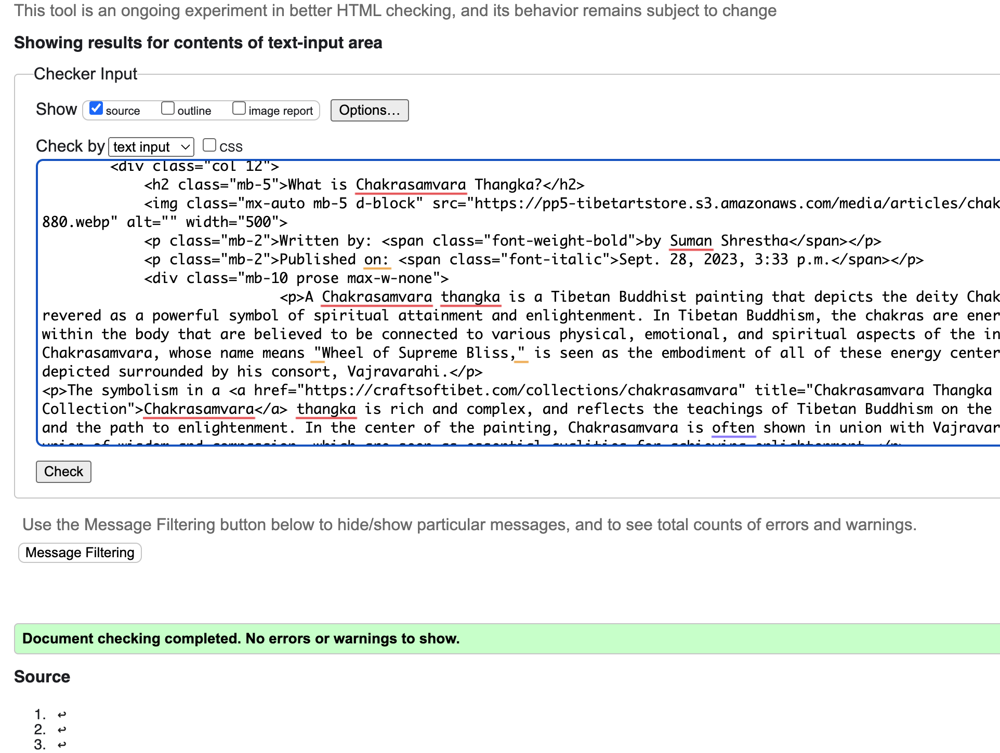
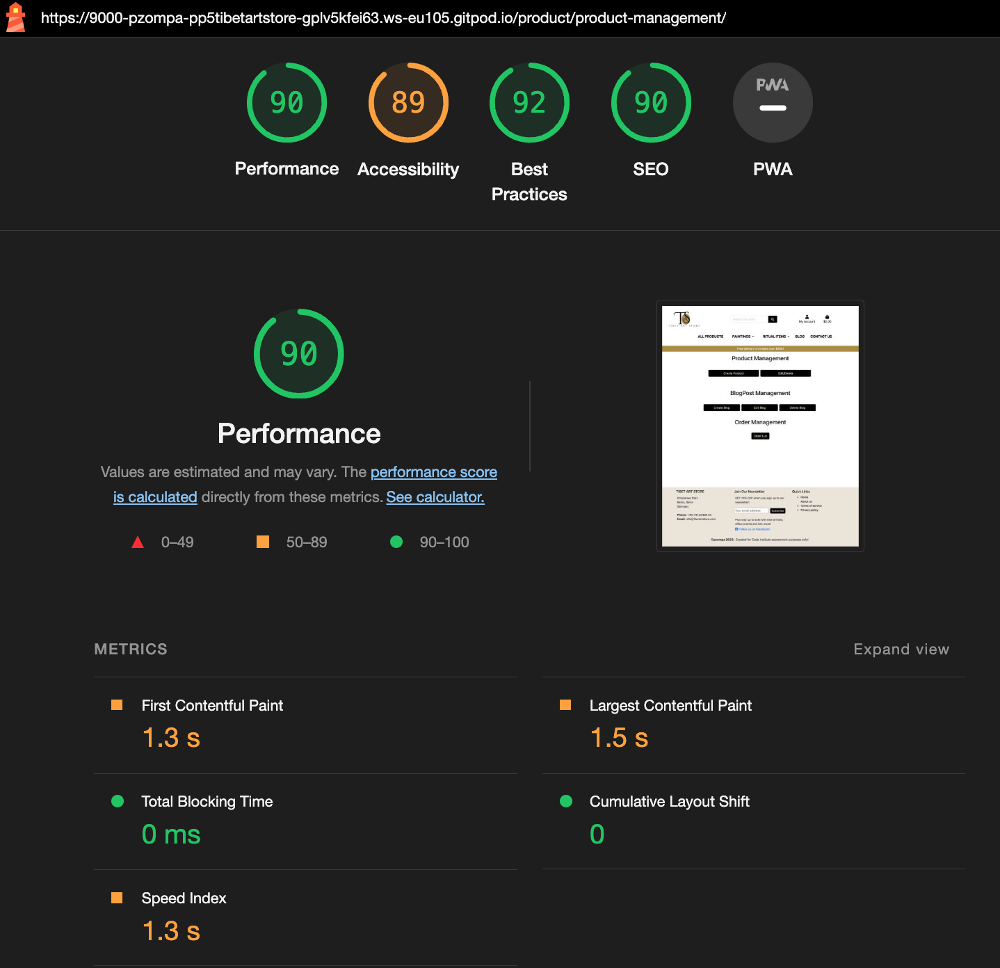
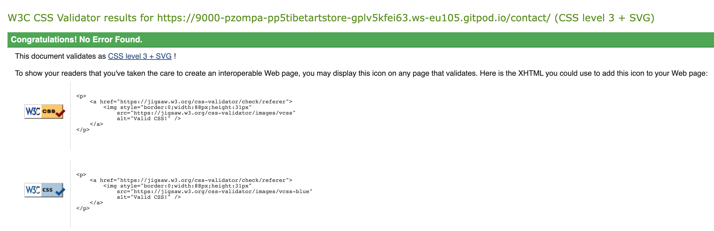

## 1.1 Reverse URL Pattern Generation Testing
38 Templates with 165 URL Patterns where tested manually. Each URL Pattern was tested on its expected URL. All tests where successful.

Reverse URL Pattern shows the tested pattern. Generated URL is the expected URL. Test shows test result.

| Reverse URL Pattern                                                  | Generated URL:                          | Test |
| -------------------------------------------------------------------- | --------------------------------------- | ---- |
| Page:   aboutus/service_policy.html                                  |                                         |      |
|                                              | /contact/contact-us/                    | PASS |
|                                                                      |                                         |      |
|                                                                      |                                         |      |
| Page:   blogpost/blogpost_detail.html                                |                                         |      |
|                                             | /blogpost/list/                         | PASS |
|               | /comment/new-blogpost-comment/1/        | PASS |
|                                             | /blogpost/list/                         | PASS |
|                                                                      |                                         |      |
|                                                                      |                                         |      |
| Page:   blogpost/blogpost_list.html                                  |                                         |      |
|                             | /blogpost/1/                            | PASS |
|               | /comment/new-blogpost-comment/1/        | PASS |
|                                                                      |                                         |      |
|                                                                      |                                         |      |
| Page:   blogpost/create_blogpost.html                                |                                         |      |
|                                         | /blogpost/save/                         | PASS |
|                                        | /product/product-management/            | PASS |
|                                                                      |                                         |      |
|                                                                      |                                         |      |
| Page:   blogpost/delete_list_blogpost.html                           |                                         |      |
|                               | /blogpost/delete/1/                     | PASS |
|                                         | /product/product-management/            | PASS |
|                                                                      |                                         |      |
|                                                                      |                                         |      |
| Page:   blogpost/edit_blogpost.html                                  |                                         |      |
|                     | /blogpost/save/1/                       | PASS |
|                                         | /product/product-management/            | PASS |
|                                                                      |                                         |      |
|                                                                      |                                         |      |
| Page:   blogpost/edit_list_blogpost.html                             |                                         |      |
|                                 | /comment/edit-blogpost/1/1/             | PASS |
|                                         | /product/product-management/            | PASS |
|                                                                      |                                         |      |
|                                                                      |                                         |      |
| Page:   cart/cart.html                                               |                                         |      |
|                                  | /cart/update/1/                         | PASS |
|                                                  | /favorite/favorite_products/            | PASS |
|                                                  | /checkout/                              | PASS |
|                                                  | /favorite/favorite_products/            | PASS |
|                                                                      |                                         |      |
|                                                                      |                                         |      |
| Page:   checkout/checkout_success.html                               |                                         |      |
|                                                   | /profile/                               | PASS |
|                                                  | /favorite/favorite_products/            | PASS |
|                                                                      |                                         |      |
|                                                                      |                                         |      |
| Page:   checkout/checkout.html                                       |                                         |      |
|                            | /product/1/detail/                      | PASS |
|                                                  | /checkout/                              | PASS |
|                                                 | /cart/                                  | PASS |
|                                                                      |                                         |      |
|                                                                      |                                         |      |
| Page:   comment/enter_comment.html                                   |                                         |      |
|                                             | /product/                               | PASS |
|                                 | /comment/delete/1/                      | PASS |
|                   | /comment/save/1/1/                      | PASS |
|                               | /comment/save/1/                        | PASS |
|                                                                      |                                         |      |
|                                                                      |                                         |      |
| Page:   new_blogpost_comment.html                                    |                                         |      |
|                                             | /blogpost/list/                         | PASS |
|                        | /comment/delete-blogpost/1/             | PASS |
|         | /comment/save-blogpost/1/1/             | PASS |
|                     | /comment/save-blogpost/1/               | PASS |
|                                                                      |                                         |      |
|                                                                      |                                         |      |
| Page:   contact/contact_us.html                                      |                                         |      |
|                                              | /contact/contact-us/                    | PASS |
|                                                                      |                                         |      |
|                                                                      |                                         |      |
| Page:   favorite/favorite_products.html                              |                                         |      |
|                                 | /product/1/detail/                      | PASS |
|                                                  | /favorite/favorite_products/            | PASS |
|                                    | /cart/add/1/                            | PASS |
|                     | /favorite/remove_from_favorites_list/1/ | PASS |
|                               | /favorite/add_to_favorites/1/           | PASS |
|                                                                      |                                         |      |
|                                                                      |                                         |      |
| Page:   home/index.html                                              |                                         |      |
|                                                  | /favorite/favorite_products/            | PASS |
|                                                                      |                                         |      |
|                                                                      |                                         |      |
| Page:   products/crafts_list.html                                    |                                         |      |
|                                               | /product/crafts-list/                   | PASS |
|                           | /product/1/detail/                      | PASS |
|                                                  | /favorite/favorite_products/            | PASS |
|                            | /comment/enter/1/                       | PASS |
|                             | /product/edit/1/                        | PASS |
|                           | /product/delete/1                       | PASS |
|                              | /cart/add/1/                            | PASS |
|                    | /favorite/remove_from_favorites/1/      | PASS |
|                         | /favorite/add_to_favorites/1/           | PASS |
|                                                                      |                                         |      |
|                                                                      |                                         |      |
| Page:   products/create_product.html                                 |                                         |      |
|                                            | /product/add/                           | PASS |
|                                                  | /favorite/favorite_products/            | PASS |
|                                                                      |                                         |      |
|                                                                      |                                         |      |
| Page:   products/delete_product_confirm.html                         |                                         |      |
|                                             | /product/                               | PASS |
|                                             | /product/                               | PASS |
|                                                                      |                                         |      |
|                                                                      |                                         |      |
| Papg:   products/gods_goddesses_list.html                            |                                         |      |
|                                       | /product/gods-goddesses-list/           | PASS |
|                           | /product/1/detail/                      | PASS |
| ?category={{ entry.product.productCategory.id }} | /products/                              | PASS |
|                            | /comment/enter/1/                       | PASS |
|                             | /product/edit/1/                        | PASS |
|                           | /product/delete/1                       | PASS |
|                              | /cart/add/1/                            | PASS |
|                    | /favorite/remove_from_favorites/1/      | PASS |
|                         | /favorite/add_to_favorites/1/           | PASS |
|                                                                      |                                         |      |
|                                                                      |                                         |      |
| Page:   products/mandala_list.html                                   |                                         |      |
|                                              | /product/mandala-list/                  | PASS |
|                           | /product/1/detail/                      | PASS |
| ?category={{ entry.product.productCategory.id }} | /products/                              | PASS |
|                            | /comment/enter/1/                       | PASS |
|                             | /product/edit/1/                        | PASS |
|                           | /product/delete/1                       | PASS |
|                              | /cart/add/1/                            | PASS |
|                    | /favorite/remove_from_favorites/1/      | PASS |
|                         | /favorite/add_to_favorites/1/           | PASS |
|                                                                      |                                         |      |
|                                                                      |                                         |      |
| Page:   products/order_list.html                                     |                                         |      |
|                                     | /product/delete-order/1/                | PASS |
|                                     | /product/delete-order/1/                | PASS |
|                                                                      |                                         |      |
|                                                                      |                                         |      |
| Page:   products/product_detail copy.html                            |                                         |      |
|                                   | /product/edit/1/                        | PASS |
|                                 | /product/delete/1                       | PASS |
|                                    | /cart/add/1/                            | PASS |
|                                             | /product/                               | PASS |
|                          | /favorite/remove_from_favorites/1/      | PASS |
|                               | /favorite/add_to_favorites/1/           | PASS |
|                                                                      |                                         |      |
|                                                                      |                                         |      |
| Page:   products/product_detail.html                                 |                                         |      |
|                                   | /product/edit/1/                        | PASS |
|                                 | /product/delete/1                       | PASS |
|                                    | /cart/add/1/                            | PASS |
|                                             | /product/                               | PASS |
|                          | /favorite/remove_from_favorites/1/      | PASS |
|                               | /favorite/add_to_favorites/1/           | PASS |
|                                                                      |                                         |      |
|                                                                      |                                         |      |
| Page:   products/product_management.html                             |                                         |      |
|                                            | /product/add/                           | PASS |
|                                             | /product/                               | PASS |
|                                           | /blogpost/create/                       | PASS |
|                                        | /blogpost/edit-list/                    | PASS |
|                                      | /blogpost/delete-list/                  | PASS |
|                                                | /product/order-list/                    | PASS |
|                                                                      |                                         |      |
|                                                                      |                                         |      |
| Page:   products/products_list.html                                  |                                         |      |
|                                                  | /favorite/favorite_products/            | PASS |
|                           | /product/1/detail/                      | PASS |
| ?category={{ entry.product.productCategory.id }} | /products/                              | PASS |
|                            | /comment/enter/1/                       | PASS |
|                             | /product/edit/1/                        | PASS |
|                           | /product/delete/1                       | PASS |
|                              | /cart/add/1/                            | PASS |
|       | /favorite/remove_from_favorites/1/      | PASS |
|            | /favorite/add_to_favorites/1/           | PASS |
|                                                                      |                                         |      |
|                                                                      |                                         |      |
| Page:   products/search_results.html                                 |                                         |      |
|                           | /product/1/detail/                      | PASS |
| ?category={{ entry.product.productCategory.id }} | /products/                              | PASS |
|                             | /product/edit/1/                        | PASS |
|                           | /product/delete/1                       | PASS |
|                                                                      |                                         |      |
|                                                                      |                                         |      |
| Page:   products/singing_bowls_list.html                             |                                         |      |
|                                        | /product/singing-bowls-list/            | PASS |
|                           | /product/1/detail/                      | PASS |
| ?category={{ entry.product.productCategory.id }} | /products/                              | PASS |
|                            | /comment/enter/1/                       | PASS |
|                             | /product/edit/1/                        | PASS |
|                           | /product/delete/1                       | PASS |
|                              | /cart/add/1/                            | PASS |
|                    | /favorite/remove_from_favorites/1/      | PASS |
|                         | /favorite/add_to_favorites/1/           | PASS |
|                                                                      |                                         |      |
|                                                                      |                                         |      |
| Page:   products/specials_list.html                                  |                                         |      |
|                                             | /product/specials-list/                 | PASS |
|                           | /product/1/detail/                      | PASS |
| ?category={{ entry.product.productCategory.id }} | /products/                              | PASS |
|                            | /comment/enter/1/                       | PASS |
|                             | /product/edit/1/                        | PASS |
|                           | /product/delete/1                       | PASS |
|                              | /cart/add/1/                            | PASS |
|                    | /favorite/remove_from_favorites/1/      | PASS |
|                         | /favorite/add_to_favorites/1/           | PASS |
|                                                                      |                                         |      |
|                                                                      |                                         |      |
| Page:   products/thangka_paintings_list.html                         |                                         |      |
|                                    | /product/thangka-paintings-list/        | PASS |
|                           | /product/1/detail/                      | PASS |
| ?category={{ entry.product.productCategory.id }} | /products/                              | PASS |
|                            | /comment/enter/1/                       | PASS |
|                             | /product/edit/1/                        | PASS |
|                           | /product/delete/1                       | PASS |
|                              | /cart/add/1/                            | PASS |
|                    | /favorite/remove_from_favorites/1/      | PASS |
|                         | /favorite/add_to_favorites/1/           | PASS |
|                                                                      |                                         |      |
|                                                                      |                                         |      |
| Page:   products/update_product copy.html                            |                                         |      |
|                                             | /product/                               | PASS |
|                                             | /product/                               | PASS |
|                                                                      |                                         |      |
|                                                                      |                                         |      |
| Page:   products/update_product.html                                 |                                         |      |
|                                 | /product/1/edit/                        | PASS |
|                                                  | /products/                              | PASS |
|                                                                      |                                         |      |
|                                                                      |                                         |      |
| Page:  profiles/profile.html                                         |                                         |      |
|                                                   | /profile/                               | PASS |
|                          | /profile/order_history/1/               | PASS |
|                                                                      |                                         |      |
|                                                                      |                                         |      |
| Page:   base.html                                                    |                                         |      |
|                                                      | /                                       | PASS |
|                                        | /product/product-management/            | PASS |
|                                                   | /profile/                               | PASS |
|                                         | /favorite/favorite_products/            | PASS |
|                                                 | /cart/                                  | PASS |
|                                                                      |                                         |      |
|                                                                      |                                         |      |
| Page:   includes/footer.html                                         |                                         |      |
|                                                | /contact/newsletter/                    | PASS |
|                                                      | /                                       | PASS |
|                                                  | /aboutus/                               | PASS |
|                                            | /aboutus/service_policy/                | PASS |
|                                            | /aboutus/privacy_policy/                | PASS |
|                                                                      |                                         |      |
|                                                                      |                                         |      |
| Page:   includes/main-nav.html                                       |                                         |      |
|                                             | /product/                               | PASS |
|                                    | /product/thangka-paintings-list/        | PASS |
|                                              | /product/mandala-list/                  | PASS |
|                                       | /product/gods-goddesses-list/           | PASS |
|                                        | /product/singing-bowls-list/            | PASS |
|                                               | /product/crafts-list/                   | PASS |
|                                             | /product/specials-list/                 | PASS |
|                                             | /blogpost/list/                         | PASS |
|                                                |                                         | PASS |
|                                                                      |                                         |      |
|                                                                      |                                         |      |
| Page:   includes/mobile-top-header copy.html                         |                                         |      |
|                                        | /product/product-management/            | PASS |
|                                                   | /profile/                               | PASS |
|                                         | /favorite/favorite_products/            | PASS |
|                                                 | /cart/                                  | PASS |
|                                                                      |                                         |      |
|                                                                      |                                         |      |
| Page:   includes/mobile-top-header.html                              |                                         |      |
|                                        | /product/product-management/            | PASS |
|                                                   | /profile/                               | PASS |
|                                         | /favorite/favorite_products/            | PASS |
|                                                 | /cart/                                  | PASS |
|                                                                      |                                         |      |
|                                                                      |                                         |      |
| Page:   includes/toasts/toast_success.html                           |                                         |      |
|                                                 | /cart/                                  | PASS |

## 1.2 URL Pattern Testing
11 urls.py files with 61 path configurations were manually tested. Each path configuration was tested on correct path name, generated url, and called function. All test were successful.

"What we test" shows the django apps and its urls.py files. It shows each path configuration as present in the url file. 

"What we expect" shows what I expected during the test. With "URL Pattern Name" we see the expected pattern name.

"Generated URL" is the url that will be dynamically generated or matched against the url pattern. 

Where applicable, I gave special attention to the correctness of the captured arguments and the parameters defined in the view functions.(product_id, comment_id etc.)

"Test" shows the test result.
| What we test                                                                                                                                        | What we expect                                                 | TEST |
| --------------------------------------------------------------------------------------------------------------------------------------------------- | -------------------------------------------------------------- | ---- |
| /workspace/pp5_tibet_art_store/aboutus/urls.py                                                                                                      |                                                                |      |
| path('', views.about_us, name\='about_us'),                                                                                                         | URL Pattern Name: about_us                                     | PASS |
|                                                                                                                                                     | Generated URL: /aboutus/                                       | PASS |
|                                                                                                                                                     | View Function: about_us                                        | PASS |
|                                                                                                                                                      |                                                                |      |
| path('service_policy/', views.service_policy, name\='service_policy'),                                                                              | URL Pattern Name: service_policy                               | PASS |
|                                                                                                                                                     | Generated URL: /aboutus/service_policy/                        | PASS |
|                                                                                                                                                     | View Function: service_policy                                  | PASS |
|                                                                                                                                                      |                                                                |      |
| path('privacy_policy/', views.privacy_policy, name\='privacy_policy')                                                                               | URL Pattern Name: privacy_policy                               | PASS |
|                                                                                                                                                     | Generated URL: /aboutus/privacy_policy/                        | PASS |
|                                                                                                                                                     | View Function: privacy_policy                                  | PASS |
|                                                                                                                                                     |                                                                |      |
|                                                                                                                                                      |                                                                |      |
| /workspace/pp5_tibet_art_store/blogpost/urls.py                                                                                                     |                                                                |      |
|                                                                                                                                                      |                                                                |      |
| path('list/', views.blogpost_list, name\='blogpost_list'),                                                                                          | URL Pattern Name: blogpost_list                                | PASS |
|                                                                                                                                                     | Generated URL: /blogpost/list/                                 | PASS |
|                                                                                                                                                     | View Function: blogpost_list                                   | PASS |
|                                                                                                                                                      |                                                                |      |
| path('\<int:pk\>/', views.blogpost_detail, name\='blogpost_detail'),                                                                                  | URL Pattern Name: blogpost_detail                              | PASS |
|                                                                                                                                                     | Generated URL: /blogpost/1/                                    | PASS |
|                                                                                                                                                     | View Function: blogpost_detail                                 | PASS |
|                                                                                                                                                      |                                                                |      |
| path('create/', views.create_blogpost, name\='create_blogpost'),                                                                                    | URL Pattern Name: create_blogpost                              | PASS |
|                                                                                                                                                     | Generated URL: /blogpost/create/                               | PASS |
|                                                                                                                                                     | View Function: create_blogpost                                 | PASS |
|                                                                                                                                                      |                                                                |      |
| path('save/', views.save_blogpost, name\='save_new_blogpost'),                                                                                      | URL Pattern Name: save_new_blogpost                            | PASS |
|                                                                                                                                                     | Generated URL: /blogpost/save/                                 | PASS |
|                                                                                                                                                     | View Function: save_blogpost                                   | PASS |
|                                                                                                                                                      |                                                                |      |
| path('save/\<int:blogpost_id\>/', views.save_blogpost, name\='save_update_blogpost'),                                                                 | URL Pattern Name: save_update_blogpost                         | PASS |
|                                                                                                                                                     | Generated URL: /blogpost/save/1/                               | PASS |
|                                                                                                                                                     | View Function: save_update_blogpost                            | PASS |
|                                                                                                                                                      |                                                                |      |
| path('edit-list/', views.edit_list_blogpost, name\='edit_list_blogpost'),                                                                           | URL Pattern Name: edit_list_blogpost                           | PASS |
|                                                                                                                                                     | Generated URL: /blogpost/edit-list/                            | PASS |
|                                                                                                                                                     | View Function: edit_list_blogpost                              | PASS |
|                                                                                                                                                      |                                                                |      |
| path('edit/\<int:blogpost_id\>/', views.edit_blogpost, name\='edit_blogpost'),                                                                        | URL Pattern Name: edit_blogpost                                | PASS |
|                                                                                                                                                     | Generated URL: /blogpost/edit/1/                               | PASS |
|                                                                                                                                                     | View Function: edit_blogpost                                   | PASS |
|                                                                                                                                                      |                                                                |      |
| path('delete-list/', views.delete_list_blogpost, name\='delete_list_blogpost'),                                                                     | URL Pattern Name: delete_list_blogpost                         | PASS |
|                                                                                                                                                     | Generated URL: /blogpost/delete-list/                          | PASS |
|                                                                                                                                                     | View Function: delete_list_blogpost                            | PASS |
|                                                                                                                                                      |                                                                |      |
| path('delete/\<int:blogpost_id\>/', views.delete_blogpost, name\='delete_blogpost'),                                                                  | URL Pattern Name: delete_blogpost                              | PASS |
|                                                                                                                                                     | Generated URL: /blogpost/delete/1/                             | PASS |
|                                                                                                                                                     | View Function: delete_blogpost                                 | PASS |
|                                                                                                                                                     |                                                                |      |
|                                                                                                                                                      |                                                                |      |
| /workspace/pp5_tibet_art_store/cart/urls.py                                                                                                         |                                                                |      |
|                                                                                                                                                      |                                                                |      |
| path('', views.view_cart, name\='view_cart'),                                                                                                       | URL Pattern Name: view_cart                                    | PASS |
|                                                                                                                                                     | Generated URL: /cart/                                          | PASS |
|                                                                                                                                                     | View Function: view_cart                                       | PASS |
|                                                                                                                                                      |                                                                |      |
| path('add/\<product_id\>/', views.add_to_cart, name\='add_to_cart'),                                                                                  | URL Pattern Name: add_to_cart                                  | PASS |
|                                                                                                                                                     | Generated URL: /cart/add/1/                                    | PASS |
|                                                                                                                                                     | View Function: add_to_cart                                     | PASS |
|                                                                                                                                                      |                                                                |      |
| path('update/\<product_id\>/', views.update_cart, name\='update_cart'),                                                                               | URL Pattern Name: update_cart                                  | PASS |
|                                                                                                                                                     | Generated URL: /cart/update/1/                                 | PASS |
|                                                                                                                                                     | View Function: update_cart                                     | PASS |
|                                                                                                                                                      |                                                                |      |
| path('delete/\<product_id\>/', views.delete_from_cart, name\='delete_from_cart'),                                                                     | URL Pattern Name: delete_from_cart                             | PASS |
|                                                                                                                                                     | Generated URL: /cart/delete/1/                                 | PASS |
|                                                                                                                                                     | View Function: delete_from_cart                                | PASS |
|                                                                                                                                                     |                                                                |      |
|                                                                                                                                                      |                                                                |      |
| /workspace/pp5_tibet_art_store/checkout/urls.py                                                                                                     |                                                                |      |
|                                                                                                                                                      |                                                                |      |
| path('', views.checkout, name\='checkout'),                                                                                                         | URL Pattern Name: checkout                                     | PASS |
|                                                                                                                                                     | Generated URL: /checkout/                                      | PASS |
|                                                                                                                                                     | View Function: checkout                                        | PASS |
|                                                                                                                                                      |                                                                |      |
| path('checkout_success/\<order_number\>', views.checkout_success, name\='checkout_success'),                                                          | URL Pattern Name: checkout_success                             | PASS |
|                                                                                                                                                     | Generated URL: /checkout/checkout_success/1                    | PASS |
|                                                                                                                                                     | View Function: checkout_success                                | PASS |
|                                                                                                                                                      |                                                                |      |
| path('cache_checkout_data/', views.cache_checkout_data, name\='cache_checkout_data'),                                                               | URL Pattern Name: cache_checkout_data                          | PASS |
|                                                                                                                                                     | Generated URL: /checkout/cache_checkout_data/                  | PASS |
|                                                                                                                                                     | View Function: cache_checkout_data                             | PASS |
|                                                                                                                                                      |                                                                |      |
| path('wh/', webhook, name\='webhook'),                                                                                                              | URL Pattern Name: webhook                                      | PASS |
|                                                                                                                                                     | Generated URL: /checkout/wh/                                   | PASS |
|                                                                                                                                                     | View Function: webhook                                         | PASS |
|                                                                                                                                                     |                                                                |      |
|                                                                                                                                                      |                                                                |      |
| /workspace/pp5_tibet_art_store/comment/urls.py                                                                                                      |                                                                |      |
|                                                                                                                                                      |                                                                |      |
| path('enter/\<int:product_id\>/', views.enter_comment, name\='enter_comment'),                                                                        | URL Pattern Name: enter_comment                                | PASS |
|                                                                                                                                                     | Generated URL: /comment/enter/1/                               | PASS |
|                                                                                                                                                     | View Function: enter_comment                                   | PASS |
|                                                                                                                                                      |                                                                |      |
| path('save/\<int:product_id\>/', views.save_comment, name\='save_comment_new'),                                                                       | URL Pattern Name: save_comment_new                             | PASS |
|                                                                                                                                                     | Generated URL: /comment/save/1/                                | PASS |
|                                                                                                                                                     | View Function: save_comment_new                                | PASS |
|                                                                                                                                                      |                                                                |      |
| path('save/\<int:product_id\>/\<int:comment_id\>/', views.save_comment, name\='save_comment_edit'),                                                     | URL Pattern Name: save_comment_edit                            | PASS |
|                                                                                                                                                     | Generated URL: /comment/save/1/1/                              | PASS |
|                                                                                                                                                     | View Function: save_comment_edit                               | PASS |
|                                                                                                                                                      |                                                                |      |
| path('delete/\<int:comment_id\>/', views.delete_comment, name\='delete_comment'),                                                                     | URL Pattern Name: delete_comment                               | PASS |
|                                                                                                                                                     | Generated URL: /comment/delete/1/                              | PASS |
|                                                                                                                                                     | View Function: delete_comment                                  | PASS |
|                                                                                                                                                      |                                                                |      |
| path('edit/\<int:product_id\>/\<int:comment_id\>/', views.edit_comment, name\='edit_comment'),                                                          | URL Pattern Name: edit_comment                                 | PASS |
|                                                                                                                                                     | Generated URL: /comment/edit/1/1/                              | PASS |
|                                                                                                                                                     | View Function: edit_comment                                    | PASS |
|                                                                                                                                                      |                                                                |      |
| path('new-blogpost-comment/\<int:blogpost_id\>/', views.new_blogpost_comment, name\='new_blogpost_comment'),                                          | URL Pattern Name: new_blogpost_comment                         | PASS |
|                                                                                                                                                     | Generated URL: /comment/new-blogpost-comment/1/                | PASS |
|                                                                                                                                                     | View Function: new_blogpost_comment                            | PASS |
|                                                                                                                                                      |                                                                |      |
| path('save-blogpost/\<int:blogpost_id\>/', views.save_blogpost_comment, name\='save_blogpost_comment_new'),                                           | URL Pattern Name: save_blogpost_comment_new                    | PASS |
|                                                                                                                                                     | Generated URL: /comment/save-blogpost/1/                       | PASS |
|                                                                                                                                                     | View Function: save_blogpost_comment_new                       | PASS |
|                                                                                                                                                      |                                                                |      |
| path('save-blogpost/\<int:blogpost_id\>/\<int:comment_id\>/', views.save_blogpost_comment, name\='save_blogpost_comment_edit'),                         | URL Pattern Name: save_blogpost_comment_edit                   | PASS |
|                                                                                                                                                     | Generated URL: /comment/save-blogpost/1/1/                     | PASS |
|                                                                                                                                                     | View Function: save_blogpost_comment_edit                      | PASS |
|                                                                                                                                                      |                                                                |      |
| path('delete-blogpost/\<int:comment_id\>/', views.delete_blogpost_comment, name\='delete_blogpost_comment'),                                          | URL Pattern Name: delete_blogpost_comment                      | PASS |
|                                                                                                                                                     | Generated URL: /comment/delete-blogpost/1/                     | PASS |
|                                                                                                                                                     | View Function: delete_blogpost_comment                         | PASS |
|                                                                                                                                                      |                                                                |      |
| path('edit-blogpost/\<int:blogpost_id\>/\<int:comment_id\>/', views.edit_blogpost_comment, name\='edit_blogpost_comment'),                              | URL Pattern Name: edit_blogpost_comment                        | PASS |
|                                                                                                                                                     | Generated URL: /comment/edit-blogpost/1/1/                     | PASS |
|                                                                                                                                                     | View Function: edit_blogpost_comment                           | PASS |
|                                                                                                                                                     |                                                                |      |
|                                                                                                                                                      |                                                                |      |
| /workspace/pp5_tibet_art_store/contact/urls.py                                                                                                      |                                                                |      |
|                                                                                                                                                      |                                                                |      |
| path('', views.contact_us, name\='contact_us'),                                                                                                     | URL Pattern Name: contact_us                                   | PASS |
|                                                                                                                                                     | Generated URL: /contact/                                       | PASS |
|                                                                                                                                                     | View Function: contact_us                                      | PASS |
|                                                                                                                                                      |                                                                |      |
| path('contact-us/', views.contact_view, name\='contact_view'),                                                                                      | URL Pattern Name: contact_view                                 | PASS |
|                                                                                                                                                     | Generated URL: /contact/contact-us/                            | PASS |
|                                                                                                                                                     | View Function: contact_view                                    | PASS |
|                                                                                                                                                      |                                                                |      |
| path('newsletter/', views.newsletter, name\='newsletter')                                                                                           | URL Pattern Name: newsletter                                   | PASS |
|                                                                                                                                                     | Generated URL: /contact/newsletter/                            | PASS |
|                                                                                                                                                     | View Function: newsletter                                      | PASS |
|                                                                                                                                                     |                                                                |      |
|                                                                                                                                                      |                                                                |      |
| /workspace/pp5_tibet_art_store/favorite/urls.py                                                                                                     |                                                                |      |
|                                                                                                                                                      |                                                                |      |
| path('add_to_favorites/\<int:product_id\>/', views.add_to_favorites, name\='add_to_favorites'),                                                       | URL Pattern Name: add_to_favorites                             | PASS |
|                                                                                                                                                     | Generated URL: /favorite/add_to_favorites/1/                   | PASS |
|                                                                                                                                                     | View Function: add_to_favorites                                | PASS |
|                                                                                                                                                      |                                                                |      |
| path('add_to_favorites_product_list/\<int:product_id\>/', views.add_to_favorites_product_list, name\='add_to_favorites_product_list'),                | URL Pattern Name: add_to_favorites_product_list                | PASS |
|                                                                                                                                                     | Generated URL: /favorite/add_to_favorites_product_list/1/      | PASS |
|                                                                                                                                                     | View Function: add_to_favorites_product_list                   | PASS |
|                                                                                                                                                      |                                                                |      |
| path('remove_from_favorites/\<int:product_id\>/', views.remove_from_favorites, name\='remove_from_favorites'),                                        | URL Pattern Name: remove_from_favorites                        | PASS |
|                                                                                                                                                     | Generated URL: /favorite/remove_from_favorites/1/              | PASS |
|                                                                                                                                                     | View Function: remove_from_favorites                           | PASS |
|                                                                                                                                                      |                                                                |      |
| path('remove_from_favorites_product_list/\<int:product_id\>/', views.remove_from_favorites_product_list, name\='remove_from_favorites_product_list'), | URL Pattern Name: remove_from_favorites_product_list           | PASS |
|                                                                                                                                                     | Generated URL: /favorite/remove_from_favorites_product_list/1/ | PASS |
|                                                                                                                                                     | View Function: remove_from_favorites_product_list              | PASS |
|                                                                                                                                                      |                                                                |      |
| path('remove_from_favorites_list/\<int:product_id\>/', views.remove_from_favorites_list, name\='remove_from_favorites_list'),                         | URL Pattern Name: remove_from_favorites_list                   | PASS |
|                                                                                                                                                     | Generated URL: /favorite/remove_from_favorites_list/1/         | PASS |
|                                                                                                                                                     | View Function: remove_from_favorites_list                      | PASS |
|                                                                                                                                                      |                                                                |      |
| path('favorite_products/', views.favorite_products, name\='favorite_products'),                                                                     | URL Pattern Name: favorite_products                            | PASS |
|                                                                                                                                                     | Generated URL: /favorite/favorite_products/                    | PASS |
|                                                                                                                                                     | View Function: favorite_products                               | PASS |
|                                                                                                                                                     |                                                                |      |
|                                                                                                                                                      |                                                                |      |
| /workspace/pp5_tibet_art_store/home/urls.py                                                                                                         |                                                                |      |
|                                                                                                                                                      |                                                                |      |
| path('', views.index, name\='home')                                                                                                                 | URL Pattern Name: home                                         | PASS |
|                                                                                                                                                     | Generated URL: /                                               | PASS |
|                                                                                                                                                     | View Function: index                                           | PASS |
|                                                                                                                                                     |                                                                |      |
|                                                                                                                                                      |                                                                |      |
| /workspace/pp5_tibet_art_store/products/urls.py                                                                                                     |                                                                |      |
|                                                                                                                                                      |                                                                |      |
| path('', views.products_list_filter, name\='products_list'),                                                                                        | URL Pattern Name: products_list                                | PASS |
|                                                                                                                                                     | Generated URL: /product/                                       | PASS |
|                                                                                                                                                     | View Function: products_list_filter                            | PASS |
|                                                                                                                                                      |                                                                |      |
| path('thangka-paintings-list/', views.thangka_paintings_view, name\='thangka_paintings_list'),                                                      | URL Pattern Name: thangka_paintings_list                       | PASS |
|                                                                                                                                                     | Generated URL: /product/thangka-paintings-list/                | PASS |
|                                                                                                                                                     | View Function: thangka_paintings_view                          | PASS |
|                                                                                                                                                      |                                                                |      |
| path('\<int:product_id\>/detail/', views.product_detail, name\='product_detail'),                                                                     | URL Pattern Name: product_detail                               | PASS |
|                                                                                                                                                     | Generated URL: /product/1/detail/                              | PASS |
|                                                                                                                                                     | View Function: product_detail                                  | PASS |
|                                                                                                                                                      |                                                                |      |
| path('mandala-list/', views.mandala_view, name\='mandala_list'),                                                                                    | URL Pattern Name: mandala_list                                 | PASS |
|                                                                                                                                                     | Generated URL: /product/mandala-list/                          | PASS |
|                                                                                                                                                     | View Function: mandala_view                                    | PASS |
|                                                                                                                                                      |                                                                |      |
| path('gods-goddesses-list/', views.gods_goddesses_view, name\='gods_goddesses_list'),                                                               | URL Pattern Name: gods_goddesses_list                          | PASS |
|                                                                                                                                                     | Generated URL: /product/gods-goddesses-list/                   | PASS |
|                                                                                                                                                     | View Function: gods_goddesses_view                             | PASS |
|                                                                                                                                                      |                                                                |      |
| path('singing-bowls-list/', views.singing_bowls_view, name\='singing_bowls_list'),                                                                  | URL Pattern Name: singing_bowls_list                           | PASS |
|                                                                                                                                                     | Generated URL: /product/singing-bowls-list/                    | PASS |
|                                                                                                                                                     | View Function: singing_bowls_view                              | PASS |
|                                                                                                                                                      |                                                                |      |
| path('crafts-list/', views.crafts_view, name\='crafts_list'),                                                                                       | URL Pattern Name: crafts_list                                  | PASS |
|                                                                                                                                                     | Generated URL: /product/crafts-list/                           | PASS |
|                                                                                                                                                     | View Function: crafts_view                                     | PASS |
|                                                                                                                                                      |                                                                |      |
| path('search_results/', views.crafts_view, name\='search_results'),                                                                                 | URL Pattern Name: search_results                               | PASS |
|                                                                                                                                                     | Generated URL: /product/search_results/                        | PASS |
|                                                                                                                                                     | View Function: crafts_view                                     | PASS |
|                                                                                                                                                      |                                                                |      |
| path('specials-list/', views.specials_view, name\='specials_list'),                                                                                 | URL Pattern Name: specials_list                                | PASS |
|                                                                                                                                                     | Generated URL: /product/specials-list/                         | PASS |
|                                                                                                                                                     | View Function: specials_view                                   | PASS |
|                                                                                                                                                      |                                                                |      |
| path('add/', views.create_product, name\='create_product'),                                                                                         | URL Pattern Name: create_product                               | PASS |
|                                                                                                                                                     | Generated URL: /product/add/                                   | PASS |
|                                                                                                                                                     | View Function: create_product                                  | PASS |
|                                                                                                                                                      |                                                                |      |
| path('\<int:product_id\>/edit/', views.update_product, name\='update_product'),                                                                       | URL Pattern Name: update_product                               | PASS |
|                                                                                                                                                     | Generated URL: /product/1/edit/                                | PASS |
|                                                                                                                                                     | View Function: update_product                                  | PASS |
|                                                                                                                                                      |                                                                |      |
| path('edit/\<int:product_id\>/', views.update_product, name\='edit_product'),                                                                         | URL Pattern Name: edit_product                                 | PASS |
|                                                                                                                                                     | Generated URL: /product/edit/1/                                | PASS |
|                                                                                                                                                     | View Function: edit_product                                    | PASS |
|                                                                                                                                                      |                                                                |      |
| path('delete/\<int:product_id\>', views.delete_product, name\='delete_product'),                                                                      | URL Pattern Name: delete_product                               | PASS |
|                                                                                                                                                     | Generated URL: /product/delete/1                               | PASS |
|                                                                                                                                                     | View Function: delete_product                                  | PASS |
|                                                                                                                                                      |                                                                |      |
| path('product-management/', views.product_management, name\='product_management'),                                                                  | URL Pattern Name: product_management                           | PASS |
|                                                                                                                                                     | Generated URL: /product/product-management/                    | PASS |
|                                                                                                                                                     | View Function: product_management                              | PASS |
|                                                                                                                                                      |                                                                |      |
| path('order-list/', views.order_list, name\='order_list'),                                                                                          | URL Pattern Name: order_list                                   | PASS |
|                                                                                                                                                     | Generated URL: /product/order-list/                            | PASS |
|                                                                                                                                                     | View Function: order_list                                      | PASS |
|                                                                                                                                                      |                                                                |      |
| path('delete-order/\<int:order_id\>/', views.delete_order, name\='delete_order'),                                                                     | URL Pattern Name: delete_order                                 | PASS |
|                                                                                                                                                     | Generated URL: /product/delete-order/1/                        | PASS |
|                                                                                                                                                     | View Function: delete_order                                    | PASS |
|                                                                                                                                                     |                                                                |      |
|                                                                                                                                                      |                                                                |      |
| /workspace/pp5_tibet_art_store/profiles/urls.py                                                                                                     |                                                                |      |
|                                                                                                                                                      |                                                                |      |
| path('', views.profile, name\='profile'),                                                                                                           | URL Pattern Name: profile                                      | PASS |
|                                                                                                                                                     | Generated URL: /profile/                                       | PASS |
|                                                                                                                                                     | View Function: profile                                         | PASS |
|                                                                                                                                                      |                                                                |      |
| path('order_history/\<order_number\>/', views.order_history, name\='order_history')                                                                   | URL Pattern Name: order_history                                | PASS |
|                                                                                                                                                     | Generated URL: /profile/order_history/1/                       | PASS |
|                                                                                                                                                     | View Function: order_history                                   | PASS |
|                                                                                                                                                     |                                                                |      |
|                                                                                                                                                      |                                                                |      |
| /workspace/pp5_tibet_art_store/tibet_art_store/urls.py                                                                                              |                                                                |
|                                                                                                                                                      |                                                                |      |
| path('products/', products_list_filter, name\='products_list'),                                                                                     | URL Pattern Name: products_list                                | PASS |
|                                                                                                                                                     | Generated URL: /product/                                       | PASS |
|                                                                                                                                                     | View Function: products_list                                   | PASS |
|                                                                                                                                                      |                                                                |      |
| path('products/', products_list_filter, name\='products'),                                                                                          | URL Pattern Name: products                                     | PASS |
|                                                                                                                                                     | Generated URL: /products/                                      | PASS |
|                                                                                                                                                     | View Function: products_list_filter                            | PASS |
|                                                                                                                                                      |                                                                |      |
| path('search/', search_view, name\='search_view'),                                                                                                  | URL Pattern Name: search_view                                  | PASS |
|                                                                                                                                                     | Generated URL: /search/                                        | PASS |
|                                                                                                                                                     | View Function: search_view                                     | PASS |

## 1.3 CRUD MODEL Testing
Tibet Art Store Django project has 6 Models (not including django MODELS). Create, Read, Update, and Delete (CRUD) has been implemented wherever applicable. All tests were successful.

ProductComment Model and BlogPostComment Model does not have "update" because its not applicable for the feature. For the Order Model, the update feature has not been implemented because of security concerns. But cloud be added on a later date with proper security messures.

"CRUD MODEL Test" shows the django app and its MODEL. The test value is shown, wherever applicable. 

"URL" shows the url that has been used for the test. Values are used, wherever applicable. 

"Test" shows the test result.

| CRUD MODEL Test               | URL                              | TEST Result |
| ----------------------------- | -------------------------------- | ----------- |
| blogpost app > BlogPost MODEL |                                  |             |
| (blogpost_id=1)               |                                  |             |
| CREATE                        | /blogpost/create/                | PASS        |
| READ                          | /blogpost/list/                  | PASS        |
|                               | /blogpost/1/                     | PASS        |
| UPDATE                        | /blogpost/edit/1/                | PASS        |
| DELETE                        | /blogpost/delete/1/              | PASS        |
|                               |                                  |             |
|                               |                                  |             |
|                               |                                  |             |
| products app > Product MODEL  |                                  |             |
|                               |                                  |             |
| CREATE                        | /product/add/                    | PASS        |
| READ                          | /product/                        | PASS        |
|                               | /product/24/detail/              |             |
| UPDATE                        | /product/edit/24/                | PASS        |
| DELETE                        | /product/delete/24               | PASS        |
|                               |                                  |             |
|                               |                                  |             |
|                               |                                  |             |
| profiles app > UserProfile    |                                  |             |
|                               |                                  |             |
| CREATE                        | /accounts/signup/                | PASS        |
| READ                          | /profile/                        | PASS        |
| UPDATE                        | /profile/                        | PASS        |
| DELETE                        | (admin page)                     | PASS        |
|                               |                                  |             |
|                               |                                  |             |
|                               |                                  |             |
| comment app > ProductComment  |                                  |             |
| (comment_id=24)               |                                  |             |
| CREATE                        | /comment/enter/24/               | PASS        |
| READ                          | /comment/enter/24/               | PASS        |
| DELETE                        | /comment/enter/24/               | PASS        |
|                               |                                  |             |
|                               |                                  |             |
|                               |                                  |             |
| comment app > BlogPostComment  |                                  |             |
| (comment_id=1)                |                                  |             |
| CREATE                        | /comment/new-blogpost-comment/1/ | PASS        |
| READ                          | /comment/new-blogpost-comment/1/ | PASS        |
| DELETE                        | /comment/new-blogpost-comment/1/ | PASS        |
|                               |                                  |             |
|                               |                                  |             |
|                               |                                  |             |
| checkout app > Order MODEL    |                                  |             |
| (order_id=1)                  |                                  |             |
| CREATE                        | /checkout/                       | PASS        |
| READ                          | /profile/                        | PASS        |
|                               | /product/order-list/             | PASS        |
| DELETE                        | /product/delete-order/1/         | PASS        |

## 1.4 Template Link Testing
I manually tested each link in 38 Templates. All tests were successful.

| Template                             | Link                                                                         | Link TEST |
| ------------------------------------ | ---------------------------------------------------------------------------- | --------- |
| aboutus/privacy_policy.html          | href="contact"                                                               | PASS      |
|                                      |                                                                              |           |
| aboutus/service_policy.html          | href=""                                              | PASS      |
|                                      |                                                                              |           |
| blogpost/blogpost_detail.html        | href=""                                             | PASS      |
|                                      | href=""               | PASS      |
|                                      | href=""                                             | PASS      |
|                                      |                                                                              |           |
| blogpost/blogpost_list.html          | href=""                             | PASS      |
|                                      | href=""               | PASS      |
|                                      |                                                                              |           |
| blogpost/create_blogpost.html        | href=""                                        | PASS      |
|                                      |                                                                              |           |
| blogpost/delete_list_blogpost.html   | href=""                               | PASS      |
|                                      | href=""                                         | PASS      |
|                                      |                                                                              |           |
| blogpost/edit_blogpost.html          | href=""                                         | PASS      |
|                                      |                                                                              |           |
| blogpost/edit_list_blogpost.html     | href=""                                 | PASS      |
|                                      | href=""                                         | PASS      |
|                                      |                                                                              |           |
| cart/cart.html                       | href=""                                                  | PASS      |
|                                      | href=""                                                  | PASS      |
|                                      | href=""                                                  | PASS      |
|                                      |                                                                              |           |
| checkout/checkout_success.html       | href=""                                                   | PASS      |
|                                      | href=""                                                  | PASS      |
|                                      |                                                                              |           |
| checkout/checkout.html               | href=""                            | PASS      |
|                                      | href=""                                            | PASS      |
|                                      | href=""                                             | PASS      |
|                                      | href=""                                                 | PASS      |
|                                      |                                                                              |           |
| comment/enter_comment.html           | href=""                                             | PASS      |
|                                      | href=""                                 | PASS      |
|                                      |                                                                              |           |
| comment/new_blogpost_comment.html    | href=""                                             | PASS      |
|                                      | href=""                        | PASS      |
|                                      |                                                                              |           |
| favorite/favorite_products.html      | href=""                                 | PASS      |
|                                      | href="?category={{ product.productCategory.id }}">       | PASS      |
|                                      |                                                                              |           |
| home/index.html                      | href=""                                                  | PASS      |
|                                      |                                                                              |           |
| products/crafts_list.html            | href=""                           | PASS      |
|                                      | href="?category={{ entry.product.productCategory.id }}"> | PASS      |
|                                      | href=""                            | PASS      |
|                                      | href=""                             | PASS      |
|                                      | href=""                           | PASS      |
|                                      |                                                                              |           |
| products/create_product.html         | href=""                                                  | PASS      |
|                                      |                                                                              |           |
| products/delete_product_confirm.html | href=""                                             | PASS      |
|                                      |                                                                              |           |
| products/gods_goddesses_list.html    | href=""                           | PASS      |
|                                      | href="?category={{ entry.product.productCategory.id }}"> | PASS      |
|                                      | href=""                            | PASS      |
|                                      | href=""                             | PASS      |
|                                      | href=""                           | PASS      |
|                                      |                                                                              |           |
| products/mandala_list.html           | href=""                           | PASS      |
|                                      | href="?category={{ entry.product.productCategory.id }}"> | PASS      |
|                                      | href=""                            | PASS      |
|                                      | href=""                             | PASS      |
|                                      | href=""                           | PASS      |
|                                      |                                                                              |           |
| products/order_list.html             | href=""                                     | PASS      |
|                                      |                                                                              |           |
| products/product_detail.html         | href="{{ MEDIA_URL }}full/{{ product_image_name }}"                          | PASS      |
|                                      | href=""                                   | PASS      |
|                                      | href=""                                 | PASS      |
|                                      | href=""                                             | PASS      |
|                                      |                                                                              |           |
| products/product_management.html     | href=""                                             | PASS      |
|                                      |                                                                              |           |
| products/products_list.html          | href=""                           | PASS      |
|                                      | href="?category={{ entry.product.productCategory.id }}"> | PASS      |
|                                      | href=""                            | PASS      |
|                                      | href=""                             | PASS      |
|                                      | href=""                           | PASS      |
|                                      |                                                                              | PASS      |
| products/search_results.html         | href=""                           | PASS      |
|                                      | href="?category={{ entry.product.productCategory.id }}"> | PASS      |
|                                      | href=""                             | PASS      |
|                                      | href=""                           | PASS      |
|                                      |                                                                              |           |
| products/singing_bowls_list.html     | href=""                           | PASS      |
|                                      | href="?category={{ entry.product.productCategory.id }}"> | PASS      |
|                                      | href=""                            | PASS      |
|                                      | href=""                             | PASS      |
|                                      | href=""                           | PASS      |
|                                      |                                                                              |           |
| products/specials_list.html          | href=""                           | PASS      |
|                                      | href="?category={{ entry.product.productCategory.id }}"> | PASS      |
|                                      | href=""                            | PASS      |
|                                      | href=""                             | PASS      |
|                                      | href=""                           | PASS      |
|                                      |                                                                              |           |
| products/thangka_paintings_list.html | href=""                           | PASS      |
|                                      | href="?category={{ entry.product.productCategory.id }}"> | PASS      |
|                                      | href=""                            | PASS      |
|                                      | href=""                             | PASS      |
|                                      | href=""                           | PASS      |
|                                      |                                                                              |           |
| products/update_product.html         | href=""                                                  | PASS      |
|                                      |                                                                              |           |
| profiles/profile.html                | href=""                          | PASS      |
|                                      |                                                                              |           |
| base.html                            | href=""                                                      | PASS      |
|                                      | href=""                                        | PASS      |
|                                      | href=""                                                   | PASS      |
|                                      | href=""                                         | PASS      |
|                                      | href=""                                            | PASS      |
|                                      | href=""                                            | PASS      |
|                                      | href=""                                             | PASS      |
|                                      | href=""                                                 | PASS      |
|                                      |                                                                              |           |
| errors/404.html                      | href=""                                                      | PASS      |
|                                      |                                                                              |           |
| errors/500.html                      | href=""                                                      | PASS      |
|                                      |                                                                              |           |
| includes/footer.html                 | href=""                                                      | PASS      |
|                                      | href=""                                                  | PASS      |
|                                      | href=" ">Terms of service</a></li>                 | PASS      |
|                                      | href=""                                            | PASS      |
|                                      | href="https://www.facebook.com/profile.php?id=61551754485242"                | PASS      |
|                                      |                                                                              |           |
| includes/main-nav.html               | href=""                                             | PASS      |
|                                      | href=""                                    | PASS      |
|                                      | href=""                                              | PASS      |
|                                      | href=""                                       | PASS      |
|                                      | href=""                                        | PASS      |
|                                      | href=""                                               | PASS      |
|                                      | href=""                                             | PASS      |
|                                      | href=""                                             | PASS      |
|                                      | href=""                                                | PASS      |
|                                      |                                                                              |           |
| includes/mobile-top-header.html      | href=""                                        | PASS      |
|                                      | href=""                                                   | PASS      |
|                                      | href=""                                         | PASS      |
|                                      | href=""                                            | PASS      |
|                                      | href=""                                            | PASS      |
|                                      | href=""                                             | PASS      |
|                                      | href=""                                                 | PASS      |
|                                      |                                                                              |           |
| includes/toasts/toast_success.html   | href=""                                                 | PASS      |

## 1.5 Permission Testing - Security
I have implemented 3 permission levels. "Anonymous" are all users that are not logged in. "User" is a user who has an account. "Superuser" is allowed all CRUD operation. 

"Minimum Permission Required" shows what minimum permission is required for a particular CRUD operation for a particular Model.

"Login Required" means that one needs a user account, but not necessarly a superuser status. 

Many times, users are limited to CRUD operation on their own objects, but the supperuser can do all relevant CRUD operations on all object.

| CRUD Permission               | Minimum Permission Required    | TEST Result |
| ----------------------------- | ------------------------------ | ----------- |
| blogpost app > BlogPost MODEL |                                |             |
|                               |                                |             |
| CREATE                        | Super User                     | PASS        |
|                               |                                |             |
| READ                          | Anonymous                      | PASS        |
|                               |                                |             |
| UPDATE                        | Super User                     | PASS        |
|                               |                                |             |
| DELETE                        | Super User                     | PASS        |
|                               |                                |             |
|                               |                                |             |
|                               |                                |             |
| products app > Product MODEL  |                                |             |
|                               |                                |             |
| CREATE                        | Super User                     | PASS        |
|                               |                                |             |
| READ                          | Anonymous                      | PASS        |
|                               |                                |             |
| UPDATE                        | Super User                     | PASS        |
|                               |                                |             |
| DELETE                        | Super User                     | PASS        |
|                               |                                |             |
|                               |                                |             |
|                               |                                |             |
| profiles app > UserProfile    |                                |             |
|                               |                                |             |
| CREATE                        | Anonymous                      | PASS        |
|                               |                                |             |
| READ                          | Login Required                 | PASS        |
|                               | (only the owner of the object) |             |
|                               |                                |             |
| UPDATE                        | Login Required                 | PASS        |
|                               | (only the owner of the object) |             |
|                               |                                |             |
| DELETE                        | Super User                     | PASS        |
|                               |                                |             |
|                               |                                |             |
|                               |                                |             |
| comment app > ProductComment  |                                |             |
|                               |                                |             |
| CREATE                        | Login Required                 | PASS        |
|                               |                                |             |
| READ                          | Anonymous                      | PASS        |
|                               |                                |             |
| DELETE                        | Login Required                 | PASS        |
|                               | (only the owner of the object) |             |
|                               |                                |             |
|                               |                                |             |
|                               |                                |             |
| comment app > BlogPostomment  |                                |             |
|                               |                                |             |
| CREATE                        | Login Required                 | PASS        |
|                               |                                |             |
| READ                          | Anonymous                      | PASS        |
|                               |                                |             |
| DELETE                        | Login Required                 | PASS        |
|                               | (only the owner of the object) |             |
|                               |                                |             |
|                               |                                |             |
|                               |                                |             |
| checkout app > Order MODEL    |                                |             |
|                               |                                |             |
| CREATE                        | Anonymous                      | PASS        |
|                               |                                |             |
| READ                          | Login Required                 | PASS        |
|                               | (only the owner of the object) |             |
|                               |                                |             |
| DELETE                        | Login Required                 | PASS        |
|                               | (only the owner of the object) |             |

## 1.6 Netative Testing
For each of the 6 MODELS the relevant negative test were done for CRUD operation.

| CRUD Permission               | Negative Testing    | TEST Result |
| ----------------------------- | ------------------------------ | ----------- |
| blogpost app > BlogPost MODEL |                                |             |
|                               |                                |             |
| CREATE                        | without superuser login        | PASS        |
|                               | cannot create blogpost         |             |
|                               |                                |             |
| READ                          | (everyone can read blogposts)  | PASS        |
|                               |                                |             |
| UPDATE                        | without superuser login        | PASS        |
|                               | cannot update blogpost         |             |
|                               |                                |             |
| DELETE                        | without superuser login        | PASS        |
|                               | cannot delete blogpost         |             |
|                               |                                |             |
|                               |                                |             |
|                               |                                |             |
| products app > Product MODEL  |                                |             |
|                               |                                |             |
| CREATE                        | without superuser login        | PASS        |
|                               | cannot create product          |             |
|                               |                                |             |
| READ                          | (everyone can read product)    | PASS        |
|                               |                                |             |
| UPDATE                        | without supersuer login        | PASS        |
|                               | cannot update product          |             |
|                               |                                |             |
| DELETE                        | without supersuer login        | PASS        |
|                               | cannot delete product          |             |
|                               |                                |             |
|                               |                                |             |
|                               |                                |             |
| profiles app > UserProfile    |                                |             |
|                               |                                |             |
| CREATE                        | everyone can create            | PASS        |
|                               | a user account with profiles   |             |
|                               |                                |             |
| READ                          | only user or superuser         | PASS        |
|                               | can read user profile          |             |
|                               |                                |             |
| UPDATE                        | only user or superuser         | PASS        |
|                               | can read update profile        |             |
|                               |                                |             |
| DELETE                        | without supersuer login        | PASS        |
|                               | cannot delete user profile     |             |
|                               |                                |             |
|                               |                                |             |
| comment app > ProductComment  |                                |             |
|                               |                                |             |
| CREATE                        | without user/superuser login   | PASS        |
|                               | cannot create Product comments |             |
|                               |                                |             |
| READ                          | (everyone can read blogposts)  | PASS        |
|                               |                                |             |
| DELETE                        | without user/superuser login   | PASS        |
|                               | cannot delete Product comments |             |
|                               |                                |             |
|                               |                                |             |
|                               |                                |             |
| comment app > BlogPostomment  |                                |             |
|                               |                                |             |
| CREATE                        | without user/superuser login   | PASS        |
|                               | cannot create blogpost comments|             |
|                               |                                |             |
| READ                          | (everyone can read             | PASS        |
|                               |  blogpost comments)            |             |
|                               |                                |             |
| DELETE                        | without user/superuser login   | PASS        |
|                               | cannot delete blogpost comments|             |
|                               |                                |             |
|                               |                                |             |
|                               |                                |             |
| checkout app > Order MODEL    |                                |             |
|                               |                                |             |
| CREATE                        | (for purchase login not required)| PASS        |
|                               |                                |             |
| READ                          | without user/superuser login   | PASS        |
|                               | cannot see transactions        |             |
|                               |                                |             |
| DELETE                        | without superuser login        | PASS        |
|                               | cannot delete transactions     |             |

## 2. W3C Validator

### 2.1 Homepage

### 2.2 Product list

### 2.3 Bloglist

### 2.4 Product detail

### 2.5 Blog detail

### 2.6 Contact us

## 3. Lighthouse
### 3.1 Home Page test

### 3.2 Product List Page test

### 3.3 Product Detail Page test

### 3.4 Blog List Page test

### 3.5 Blog Detail Page test

### 3.6 Favorite Page test

### 3.7 My Profile Page test

### 3.8 Contact Us Page test

### 3.9 Product Management Page test

## 4. CSS Jigsaw W3 Validator
### 4.1 Home Page CSS test

### 4.2 Product List Page CSS test

### 4.3 Product Detail Page CSS test

### 4.4 Blog List Page test

### 4.5 Blog Detail Page test

### 4.6 Contact Us Page test

### 4.7 Favorite Page test

### 4.8 Cart Page test

### 4.9 Checkout Page test

### 4.10 My Profile Page test

## 5. Javascript- JShint

## 6. CI Python Linter
### 6.1 AboutUs-urls.py test

### 6.2 AboutUs-views.py test

### 6.3 Blogpost-admin.py test

### 6.4 Blogpost-forms.py test

### 6.5 Blogpost-models.py test

### 6.6 Blogpost-urls.py test

### 6.7 Blogpost-views.py test

### 6.8 Cart-contexts.py test

### 6.9 Cart-urls.py test

### 6.10 Cart-views.py test

### 6.11 Checkout-admin.py test

### 6.12 Checkout-forms.py test

### 6.13 Checkout-models.py test

### 6.14 Chechout-signals.py test

### 6.15 Checkout-urls.py test

### 6.16 Checkout-views.py test

### 6.17 Checkout-webhook_handler.py test

### 6.18 Checkout-webhooks.py test

### 6.19 Comment-admin.py test

### 6.20 Comment-forms.py test

### 6.21 Comment-models.py test

### 6.22 Comment-urls.py test

### 6.23 Comment-views.py test

### 6.24 Contact-admin.py test

### 6.25 Contact-forms.py test

### 6.26 Contact-models.py test

### 6.27 Contact-urls.py test

### 6.28 Contact-views.py test

### 6.29 Favorite-admin.py test

### 6.30 Favorite-models.py test

### 6.31 Favorite-urls.py test

### 6.32 Favorite-views.py test

### 6.33 Home-urls.py test

### 6.34 Home-views.py test

### 6.35 Products-admin.py test

### 6.36 Products-forms.py test

### 6.37 Products-models.py test

### 6.38 Products-urls.py test

### 6.39 Products-views.py test

### 6.40 Profiles-admin.py test

### 6.41 Profiles-forms.py test

### 6.42 Profiles-models.py test

### 6.43 Profiles-urls.py test

### 6.44 Profiles-views.py test

### 6.45 Tibet_art_store-asgi.py test

### 6.46 Tibet_art_store-settings.py test

### 6.47 Tibet_art_store-urls.py test

### 6.48 Tibet_art_store-views.py test

### 6.49 Tibet_art_store-wsgi.py test

## 7. Wave Validator

